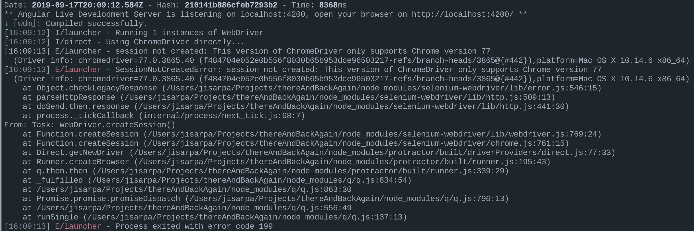

name: E2E testing
class: middle, center, title

# E2E testing with Protractor and&nbsp;Friends
## or: How I Learned to Stop Worrying and Test the DOM
### Ryan Parsley
#### October 25, 2019

???

Hello, I'm Ryan Parsley. I'm a Sr Software Engineer working on Carrier 360.

I have the privilege to teach you a thing that is otherwise a little tricky to learn.

It's not a very tricky subject, I don't want to scare you into a defensive posture.

It's just that best practices feel more rarely discussed with E2E testing than they do with Unit testing. 

---
background-image: url(./assets/testPyramid.png)
background-size: 500px auto

# The code confidence parfait

???

I'm getting ahead of myself. Let's start with answering "What is an end to end test?"

---

# What is an end to end test!?

* Test suite with a browser dependency
* AKA: Integration test
* AKA: Functional test

???

There are a lot of tools to provide you code confidence, and many of those tools come by more than one name. Or, are otherwise hard to distinguish between. I'm calling this class of tests e2e tests because that's the name of the folder the angular cli puts them in by default.

---
class: middle, center

# In other words...
## E2E tests run in the browser to more closely match real world user interaction with our app.
---

background-image: url(./assets/whyE2E.gif)
background-size: 500px auto

# But we have unit tests...

???

The whole isn't always equal to the sum of it's parts.

---

# Key components of end to end testing

--
* Browser

--
* Tool to drive a browser
  * Selenium/WebDriver
  * Puppeteer

--
* Test Framework (interaction)
  * Protractor
  * Cypress

--
* Test Framework (assertions)
  * Jasmine
  * Mocha
  * QUnit

???

Basically, you have a real browser somehow controlled by code to poke around your website. If this makes sense, you're way ahead of the game already. We have a framework that negotiates the interaction through a driver that controls a browser to satisfy assertions.

Protractor speaks Jasmine and adds Angular sugar on top of WebDriver. It communicates with a browser via the Selenium Server.

---
class: middle, center, title

# Protractor

---

# So what is Protractor?

--

> Protractor is an end-to-end test framework for Angular and AngularJS
applications. Protractor runs tests against your application running in a real
browser, interacting with it as a user would. <span>&mdash;[Protractortest.org]()</span>

???

In some ways, it's easier to get started with E2E testing than with unit testing.

With unit testing, you purposefully break out of standard app flow and Dependency Injections to focus one each piece of the machine. With E2E testing, you're taking a step back to watch the machine work. So you don't need to wire up any Dependency injection or manually trigger lifecycle events. You're testing the fully functioning app. 

---
# What does that look like!?

```javascript
// Starts out pretty familiar
describe('todo list', function() {
  it('should add a todo', function() {

    // We don't have this in Unit tests
    browser.get('https://angularjs.org');

    // click on a DOM element
    element(by.css('[value="add"]')).click();

    // Locate something in the DOM to assert against
    var todoList = element.all(by.repeater('todo in todoList.todos'));
    expect(todoList.count()).toEqual(3);
    ...
  });
});
```

---
class: middle, center

# Good news

## Angular CLI wires up Protractor out of the box...

---
class: middle, center

# Bad news

--

## ...kind of


???
Selenium has comically useless feedback sometimes. Unfortunately, the first opportunity for this is the first time you ever use it if chrome versions come out of sync with node module dependency. If you see something like this, upgrade chrome.

---
class: middle, center, title

# Strategy

---

# What should we test?

???

End to end tests should focus on actions more than what is rendered on the screen. We will use what's on the screen to assert if action complete correctly, but the content rendered to the page is more the per view of the unit tests around that functionality.

Example: when testing if clicking a link takes you to an appropriate page, you should not be concerned with if that page has specific content if you can avoid it. Choosing the url, or active menu item are likely better things to assert against.

---

# Workflows

???

Tests should not be named or otherwise organized in a way that is coupled with a
bug or task. E2E tests are meant to hang around for a long time to tell the
story of what a user should experience as they perform various tasks. They will
likely hit many components and multiple routes so naming after a given route is
largely not what we want to do.

---

# Smoke tests

???

When we speak of smoke tests, we're largely referring to a subset of our tests
that are read only and can be run against the production environment without
fear of changing prod data. We'll tag these tests `#smoke` (eg `it('should visit
my-loads #smoke', () => {...})`)

---

# Change is the only constant in E2E

???

It's inevitable that things will change on the frontend. The DOM will change as
we redesign or add features. The DOM will change as we _refactor_ CSS. Content
will change over time. If these things weren't true, we wouldn't need to do
regression testing. These changes are part of the reason that E2E testing is the
most brittle of testing paradigms. Be aware of this brittleness and avoid it as
much as you can.

---

# Do not...
* use overly specific selectors to find elements (don't just copy the class values from chrome inspector).
* assert against copy that's likely to change. (Switching copy from using Oxford Comma to AP Style should not break a test).

---

# Do...
  * introduce unique data attributes (uncoupled from styling) if you don't otherwise have a reasonable selector to hook on to

---

# Locators
## Be as specific as you need, but no more

???

Do not simply copy the class attribute from chrome inspector and past that in
`by.css()`. That is often littered with presentational helpers that introduce
additional brittleness to your tests. If someone comes by and eliminates a
`.float` class either because the element's position has changed or a good old
fashion CSS refactor, that should not likely make a test fail.

---

# Do not wait static amounts of time

???

When you set a static wait time, you guarantee the tests will wait an amount of
time that you hope is greater than the worst case scenario. Craig searched the
specs and calculated about 28 minutes of waiting is hard coded.
---
class: middle, center, title

# Tactics

---

# When you need to wait for things

---

# Do not do this 

```javascript
public async verifySizeAfterResize(): Promise<boolean> {
  // Vote of no confidence in DOM readiness
  await this.actions.shortWait('Short Wait');
  const width = 1000, height = 800;
  browser.driver.manage().window().setSize(width, height);
  // ಠ_ಠ
  await this.actions.mediumWait('Medium Wait');
  await this.actions.moveMouseToElement(
    this.myLoadsSearchIcon,
    'Move mouse to Icon');
  await this.actions.click(
    this.myLoadsSearchIcon,
    'Click the search icon');
  // ಠ_ಠ
  await this.actions.shortWait('Short Wait');
  return await this.actions.isElementDisplayed(
    this.searchButtonSearchPanel,
    'Display the Search Button');
}
```
---
# A better approach
## Resolve promises instead of choosing arbitrary times

```
beforeEach(async () => {
  await myLoads.open('/my-loads?doAsUserID=JBHKOPA2');
  await pageStable();
});

const pageStable = async() => {
  Promise.all([
    await browser.wait(EC.not(EC.visibilityOf(myLoads.loadingMask)), 20000),
    await myLoads.actions.waitUntilElementInvisible(
      myLoads.growl,
      'Wait for growl to go away')
  ]);
};

it('should open my-loads #smoke', () => {
  expect(myLoads.title.getText()).toEqual(titleText);
});

```
---
# ExpectedConditions

A library of canned expected conditions that are useful for protractor.

Each condition returns a function that evaluates to a promise.

```
var EC = protractor.ExpectedConditions;
var button = $('#xyz');
var isClickable = EC.elementToBeClickable(button);

browser.get(URL);
browser.wait(isClickable, 5000); //wait for an element to become clickable
button.click();
```

[Documentation](https://www.protractortest.org/#/api?view=ProtractorExpectedConditions)
---
class: middle, center, title

# Anti-patterns

---

# Timeouts

```javascript
// DO NOT DO THIS!
browser.sleep(20000)
```

---

# Brittle selectors
```Javascript
//(╯°□°)╯︵ ┻━┻
originStateSearchBox = element.all(by.className(
  'ui-inputtext ui-widget ui-state-default ui-corner-all' +
  'ui-autocomplete-input ng-star-inserted'
)).get(1);
```
---

#  Overly eager testing

---
class: middle, center, title

# Less talk more code

---
# App to be tested
## AcuteBlog

* Authentication
  * Register
  * Login
  * Restricted access
* Post
  * Create (logged in users)
  * Read (anyone)
  * Update (only your own)
  * Delete (only your own)

---
# Run tests

```bash
ng e2e
```
---

# Exercise 1
## Hello World!

* Write a test that confirms the app is running

---
# Exercise 2
## Happy path of an anonymous reader

--

* Home page should be accessible
--

* Dashboard page should *not* be accessible
--

* Bogus links redirect to 404
--

* Posts should be readable
--

* Posts should *not* be writable

---
# Exercise 3
## Users should be able to register

--

* Route should be accessible
--

* Link should be in the menu
--

* Form should function
--

* Registered user should be redirected to dashboard

---
# Exercise 4
## Users should be able to log in

--

* Route should be accessible
--

* Link should be in the menu
--

* Form should function
--

* Logged in user should be redirected to dashboard

---
# Exercise 5
## Happy path of a user with an account

--

* Users can log in
--

* Logged in users can create posts
--

* Logged in users can edit their own posts
--

* Logged in users can comment on posts of others
--

* Logged in users cannot edit the posts of others
--

* Logged in users can delete their own posts
--

* Logged in users can *not* delete the posts of others

---
class: links

# Further reading

* [https://martinfowler.com/bliki/TestPyramid.html](https://martinfowler.com/bliki/TestPyramid.html)
* [https://testing.googleblog.com/2015/04/just-say-no-to-more-end-to-end-tests.html](https://testing.googleblog.com/2015/04/just-say-no-to-more-end-to-end-tests.html)
* [https://kentcdodds.com/blog/unit-vs-integration-vs-e2e-tests](https://kentcdodds.com/blog/unit-vs-integration-vs-e2e-tests)
* [https://www.cypress.io/blog/2019/08/02/guest-post-angular-adding-cypress-ui-tests-to-your-devops-pipeline/](https://www.cypress.io/blog/2019/08/02/guest-post-angular-adding-cypress-ui-tests-to-your-devops-pipeline/)
* [https://moduscreate.com/blog/protractor-and-jasmine-data-provider-write-once-test-many/](https://moduscreate.com/blog/protractor-and-jasmine-data-provider-write-once-test-many/)
* [Protractor's Official Typescript Examples](https://github.com/angular/protractor/tree/5.4.1/exampleTypescript)
* [Code Repo From Testing Angular Applications](https://github.com/testing-angular-applications/testing-angular-applications/tree/master/chapter09)
* [https://www.blackpepper.co.uk/blog/if-youre-using-browser-sleep-in-your-cucumber-protractor-selenium-tests-youre-doing-it-wrong](https://www.blackpepper.co.uk/blog/if-youre-using-browser-sleep-in-your-cucumber-protractor-selenium-tests-youre-doing-it-wrong)
